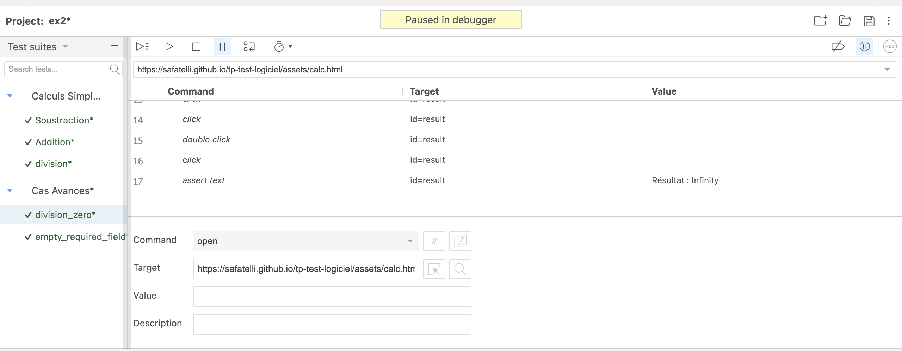

# Exercice A Rendre 1

## Premier test reussi:


code du script dans exercice1/test_ex1_success.py

## Second Test échoué:


code du script dans exercice1/test_ex2_failure.py

## Analyse

Ce resultat est parfaitement normal, puisque le second test, test_ex1_failure.py, execute un assert_text ""Bonjour, ali !" alors que le nom que l'on 
met dans l'input field est: "mahdi" . 

## Solution

Au lieu de hardcoder les input/outputs de ce test, nous pouvons faire un assert_text avec le contenu de l'input field:

```python
assert self.driver.find_element(By.ID, "message").text == "Bonjour, " + self.driver.find_element(By.ID, "username").get_attribute("value") + " !"
```

code dans exercice1/test_ex1_final.py


# Exercice A Rendre 2



Scripts cas avancés et calculs simple dans le folder exercice 2. 
# Exercice 3: Suite de tests Selenium pour le site Web Demoblaze

## 1. Tests réussis

### Ajout au panier


### Catégories


### Confirmation apres paiement


## 2. Tests échoués et corrections

### Pages

#### Erreur
Ce test a échoué en raison d'un délai d'attente expiré lors de la recherche du bouton de lecture vidéo sur la page "À propos".

#### Correction
La correction implique d'augmenter le délai d'attente ou d'ajuster le sélecteur CSS pour localiser correctement le bouton de lecture vidéo.


### Supprimer du panier


#### Erreur
Ce test a échoué car le nombre d'articles dans le panier a changé, ce qui a provoqué une défaillance des sélecteurs utilisés dans le test.

#### Correction
La correction implique de modifier les sélecteurs pour qu'ils puissent s'adapter dynamiquement au nombre d'articles dans le panier.

## 3. Améliorations


Afin d'ameliorer les tests, on a utilisé des variables pour stocker des données telles que les noms de produits, les adresses de livraison, etc. Cela rend les tests plus dynamiques et réutilisables.
On a aussi ajouté des assertions pour vérifier que les actions effectuées ont produit les résultats attendus. 
### Exemples
#### Amelioration de test d'ajout au panier 
- Definition des variables 
```python
# Define variables
        product_name = "Samsung galaxy s6"
        expected_message = "Product added"
        
        # Click on the product
        self.driver.find_element(By.LINK_TEXT, product_name).click()
```
- Ajout des assertions : 
```python
    # Assertion to verify product added message
        alert_text = self.driver.switch_to.alert.text
        assert alert_text == expected_message, f"Expected message '{expected_message}' not found. Actual message: {alert_text}"
```
#### Amelioration de test de categories
- Definition des variables 
```python
# Define variables
       category = "Laptops"
     
        
        # Click on the categories
        self.driver.find_element(By.ID, "itemc").click()
        self.driver.find_element(By.LINK_TEXT, category).click()
```
- Ajout des assertions : 
```python
  assert self.driver.current_url == "https://www.demoblaze.com/#", "Failed to navigate to  {category} category."
```

